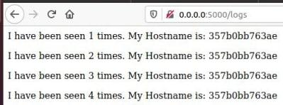

Lab 5

1. Using commands: 1)pipenv --python 3.8, 2)pipenv install -r requirements.txt, 3)pipenv run python app.py When the last command did't work I use 4)sudo docker run --rm --net=host -it -p 6379:6379 redis
2. Using command pipenv run pytest test_app.py --url http://localhost:5000
3. Tests did not work because directory logs had not existed. After creating it, all 4 tests passed.

Makefile

1. Makefile
    a)run - runs site and redis server
    b)test-app - runs tests
    c)docker-prune - clears all conteiners and images
2. Using command `sudo make app tests`
3. Using command `sudo docker network rm appnet` to remove previous network
4. Using commands `sudo make run`, `sudo make test-app`
    
    
    
5. Using command `sudo make docker-prune`
6. Adding `docker-push` directive in Makefile

Docker-compose

1. First network public is used for interaction with site. Second network secret is used only for redis because of nobody could access from outside.
2. Using command `sudo docker-compose -p lab_5 up`
3. We must write 0.0.0.0 address
4. Using command `sudo docker-compose down`
5. Using command `sudo docker-compose push`
    As for me, it is better to use Makefile. Its structure is clearer for me and there is ability to clean containers and images.
6. Adding docker-compose.yml for lab_4
